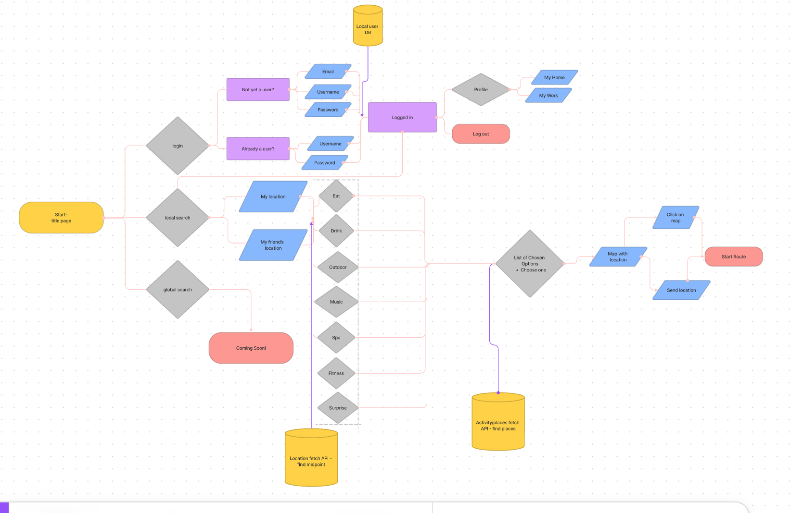

# About Middley

Spend less time having to decide where to meet, and spend more time meeting up.

Middley is the perfect way to have your friends meet you half way.  The app calculates the midway point between two locations and lets users filter-out their choice fatigue by displaying the perfect meet-up spots based on preferred activity types. You can try it out here:  https://fs-22-team3.vercel.app/.

## Motivation

## User Flow



The above diagram shows the updated (and current) user flow of our app. 

The user can either start by logging in, choosing a local search of a worldwide search (not active yet).

If clicking on the log in section, the user has the option to log in or sign up. Once logged in, the user can save their home and work address for future use.

If clicking on the local view, the user is then asked to input two addresses. They can use the saved home/work address for the first input if desired. The second address should be the location of their friend.

Once the midpoint is calculated, the user can choose from a variety of activities. 

After choosing, they can see a few options of places around the middle of the two locations. They have reviews and price points to help choose.

Once chosen, they can click 'Go!' to bring up a map. If they click on the map, it will open in Google Maps. If they click 'Share Place' this will generate a link to send to a friend, which will bring up the location on Google Maps on their phone. 

Both parties will now be able to navigate to the chosen location with ease. 

## DB schema

## Tools used

The frontend was created using [Create React App](https://create-react-app.dev/docs/making-a-progressive-web-app/) (CRA), as a Progressive Web Application.

This app was depoyed on [Vercel](https://vercel.com/docs), as a CRA application and standalone Express. A cloud mySQL database was created on [PlanetScale](https://planetscale.com/).

## Installation instructions

### Client

In the client folder:

1. Run `npm install`
2. Run `npm start` to start the application

### Server

1. Run `npm install`
2. Run `npm start` to start the server

### Database

The local database we are using is called userdata. It has one table: users.

1. Open MySQL in your terminal by running `mysql -u root -p;`

2. Create a new database: `CREATE DATABASE userdata;`

3. Create an `.env` file in the project folder which contains MySQL authentication information. For example:

```bash
DB_HOST=localhost
DB_USER=root
DB_NAME=userdata
DB_PASS=(your password)
```

4. In a separate terminal in the server folder, run `npm run migrate`

5. In your MySQL terminal window, run `USE userdata;` then `SHOW TABLES;` (it should contain 1 table: `users`)

6. You can run `DESCRIBE users;` to check that the table has been set up correctly


